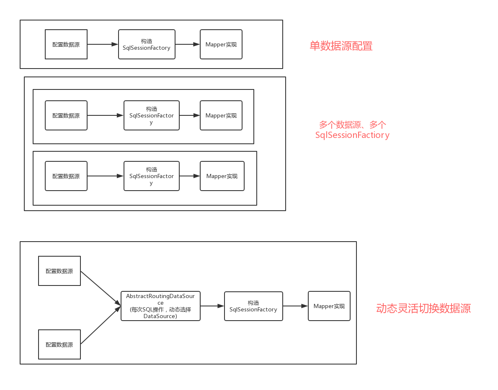

### spring /springboot  整合mybatis
1. 配置数据源
```
<!-- 数据源 -->
	<bean id="dataSource" class="com.zaxxer.hikari.HikariDataSource">
		<property name="driverClassName" value="${jdbc.driver}"/>
		<property name="jdbcUrl" value="${jdbc.url}"/>
		<property name="username" value="${jdbc.username}"/>
		<property name="password" value="${jdbc.password}"/>
	</bean>
```

2. 构造SqlSessionFactory
```
    <bean id="sqlSessionFactory" class="org.mybatis.spring.SqlSessionFactoryBean">
		<!-- 定义数据源 -->
		<property name="dataSource" ref="dataSource"/>
		<!-- mybatis-config.xml -->
		<property name="configLocation" value="classpath:mybatis/mybatis-config.xml"/>
		<!-- 别名包 -->
		<property name="typeAliasesPackage" value="cn.pojo"/>
		<!-- mapper.xml -->
		 <property name="mapperLocations" value="classpath:mybatis/mappers/*/*.xml"/>
	</bean>
```
3. 定义Mapper接口扫描器
```
    <bean class="org.mybatis.spring.mapper.MapperScannerConfigurer">
		<!-- 扫描mapper包 -->
		<property name="basePackage" value="cn.mapper"/>
	</bean 
```
5. 定义事务管理器
```
	<bean id="transactionManager"
		class="org.springframework.jdbc.datasource.DataSourceTransactionManager">
		<property name="dataSource" ref="dataSource" />
	</bean>
```

6. spring事务事务配置有两种方式
- 注解方式
```
    <!--开启注解方式-->
    <tx:annotation-driven transaction-manager="transactionManager"/>
```

- xml配置方式
```
    <!-- 定义事务策略 -->
	<tx:advice id="txAdvice" transaction-manager="transactionManager">
		<tx:attributes>
			<!--定义查询方法都是只读的 -->
			<tx:method name="query*" read-only="true" />
			<tx:method name="find*" read-only="true" />
			<tx:method name="get*" read-only="true" />

			<!-- 主库执行操作，事务传播行为定义为默认行为 -->
			<tx:method name="save*" propagation="REQUIRED" />
			<tx:method name="update*" propagation="REQUIRED" />
			<tx:method name="delete*" propagation="REQUIRED" />

			<!--其他方法使用默认事务策略 -->
			<tx:method name="*" />
		</tx:attributes>
	</tx:advice>

	<aop:config>
		<!-- 定义切面，所有的service的所有方法 -->
		<aop:pointcut id="txPointcut" expression="execution(* cn.service.*.*(..))" />
		<!-- 应用事务策略到Service切面 -->
		<aop:advisor advice-ref="txAdvice" pointcut-ref="txPointcut"/>
	</aop:config>
```

### spring /springboot  多数据源配置


 


